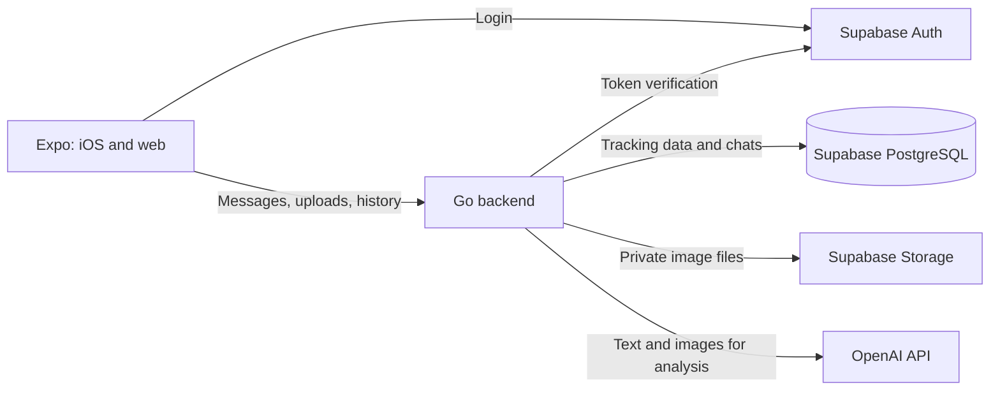

# Architecture

As of September 17, 2026. Architecture for the first usable version described in the [implementation plan](PLAN.md); Coolify hosting and native device acceptance remain pending.

## Structure and responsibilities



Go, Supabase, and the web interface are hosted through Coolify on privately operated infrastructure. OpenAI is the external service for AI processing. Self-hosted storage therefore does not mean that image analysis takes place exclusively on the user's own server.

| Component | Responsibility |
| --- | --- |
| Expo app | Display login, day navigation, chat, image selection, daily totals, and corrections |
| Go backend | Verify user access, process uploads, assemble context, call OpenAI, validate results, and write tracking data |
| Supabase Auth | Manage identity, login, and sessions |
| PostgreSQL | Store persistent domain data and processing states |
| Supabase Storage | Store photos and screenshots under private object paths |
| Coolify | Deploy services and configure secrets and persistent volumes |

The first version uses one Go service. Additional microservices, a separate queue platform, or a vector database are outside the agreed scope.

## Project structure

```text
fitty/
  README.md
  docs/
    PLAN.md
    ARCHITECTURE.md
    DEVELOPMENT.md
  apps/
    client/             # Expo project for iOS and the web
  server/               # Go module with API and processing
  supabase/
    migrations/         # Versioned SQL migrations
  deploy/               # Application-specific Coolify/container configuration
```

Login, profiles, daily chats, text tracking, corrections, and private photo attachments with image analysis are implemented. The local Supabase stack runs through the versioned CLI configuration; secrets and a copy of the entire upstream project do not belong in the repository. The [development guide](DEVELOPMENT.md) describes tests and remaining verification limits.

## Authentication and data access

The app signs in through Supabase Auth and sends its access token to Go. For every request, Go asks the configured Supabase Auth service to validate the token through `GET /auth/v1/user` (maximum five seconds). User identity comes exclusively from a successful response. Local JWT verification using JWKS is not currently implemented. A user ID supplied by the client is not sufficient authorization.

Go accesses domain data through an internal PostgreSQL connection. Every read and write is restricted to the authenticated user; referenced chats, entries, and images must also belong to that user. The `fitty_api` database account has only the required permissions on application tables, including DELETE for attachment cleanup. It is neither a superuser nor a member of privileged roles.

The automatically provided Supabase Data API is not needed for domain tables. These tables are not exposed to the client. If direct access is added later, appropriate grants and RLS policies will be configured explicitly. The Go connection does not automatically receive the auth context of a Supabase client request.

Images reside in private buckets. Go mediates uploads and retrieval or issues short-lived download links after checking permissions. Object paths are stored permanently; expiring signed URLs are not. Service keys and OpenAI keys remain exclusively on the server.

## Domain data model

The following tables are implemented through migrations. Food and activities use the same entry table, with a type field and type-specific database constraints.

| Table | Main contents |
| --- | --- |
| `profiles` | Auth user reference, time zone, free-text goals, dietary preferences, and numeric target version |
| `daily_targets` | Optional calorie/macronutrient targets per user and effective date |
| `daily_target_changes` | Record of a target save operation with request ID, expected version, date, and target values |
| `days` | User, local date, daily chat, and version for deletion confirmations |
| `messages` | Day, role, text, client-generated message ID, and processing status |
| `attachments` | User, date, optional message, position, Storage path, SHA-256, media type, size, dimensions, and upload status |
| `tracking_entries` | Food/activity type, day, label, quantity, energy, macronutrients or duration/distance, data source, and source message |
| `food_favorites` | Per-account food snapshots, keyed by the original entry ID, independent of daily chats |
| `analysis_jobs` | Message, processing status, attempts, lease, and model |
| `entry_changes` | Change with before/after values, source message, and evidence text |
| `manual_entry_changes` | Direct change with user, request ID, expected version, and before/after values |
| `day_deletions` | Deletion confirmation with user, request ID, day ID, date, and expected version; no chat content |
| `deleted_identifiers` | Retired message/image UUIDs used to reject delayed retries |
| `progress_photos` | Private progress photos with capture date, viewing angle, object path, and upload/deletion status |
| `progress_photo_tombstones` | Deleted progress photo UUIDs per user, without image data |

Key rules:

- At most one daily chat exists per user and local date.
- Technical timestamps are stored in UTC; the domain date is determined by the profile time zone or an explicitly selected target day.
- Changing the profile time zone does not silently move existing entries to other days.
- An upload and a message can contain several related images. Image count does not determine meal count.
- Nutritional values refer to the quantity consumed. Sources and assumptions distinguish user input, extracted readings, and AI estimates.
- Calories and nutritional values use suitable decimal storage; display rounding happens only on output.
- Food and activity entries reference their original message and, for corrections, the correcting message.
- Daily totals come from valid structured entries. They are not taken from changing AI summaries.
- Results and images remain available when the OpenAI API is temporarily unreachable.

Direct changes use the same domain value ranges as the AI. Entry versions prevent overwriting newer values; request IDs make retries idempotent. The mutation and its manual audit record are saved together. Direct editing waits while AI analyses are pending; claiming new worker jobs and direct changes coordinate through a short shared advisory lock. No model call is made for this. Deleting an entry sets `deleted_at`, immediately excluding it from active totals. Historical chats, photos, and change logs remain; this differs from full chat deletion.

## Favorite meals

Favorites store a snapshot of a food entry's label, portion, nutritional values, notes, and source. `GET /v1/favorites` returns the current account's favorites. `PUT /v1/favorites/{entry_id}` accepts the displayed `entry_version` and copies only a live, owned food entry with that version. A repeated save returns the existing snapshot, including after source changes or deletion. `DELETE /v1/favorites/{entry_id}` removes only that account's bookmark and is idempotent. Activities cannot be bookmarked.

The table references the Auth account, with no foreign key to the original entry or day. Deleting a daily chat therefore leaves saved favorites intact; deleting the account removes them. Saves lock the profile row to enforce the 200-favorite limit under concurrency. Saving/removing favorites changes neither tracking entries nor daily totals and creates no AI jobs.

The client suggests up to five matching meal names at the text caret after at least two characters, ignoring case and accents. Selecting one replaces the matching phrase while preserving surrounding text and attached photos. The plus menu also lists favorites and permits removal. Selection inserts an editable text description of the saved portion, values, source, and notes; it never submits automatically. Sending follows the existing durable message and AI processing flow, so a favorite is not a direct or guaranteed exact ledger insertion. Editing the original meal does not silently update its saved snapshot; remove and save again to update it.

## Personal daily targets

Numeric targets are stored separately from the existing free-text profile. Each target set applies from `effective_from` until the next set. For a daily chat, Go loads the latest set whose effective date is on or before the chat date. Before the first set, all targets are `null`; a later set containing only `null` removes targets from that date onward. Multiple changes on the same day replace that day's target set. Deleting a chat removes neither targets nor their history.

New target changes may take effect only from today in the saved profile time zone. PostgreSQL stores positive decimal values with two decimal places; each of the four fields may independently be `null`. Nothing is derived automatically from body measurements, macros, or activity expenditure. API persistence, the daily overview, and AI context use the same value object.

The profile row serializes target changes and time zone changes. The target set, incremented `targets_version`, and request record are saved in one transaction. Stale versions or a change in today's date require another explicit confirmation. An identical, already confirmed request ID makes no further changes and returns the current target set, even after a date change or subsequent edits. Profile changes through the existing endpoint leave numeric targets untouched.

Daily totals continue to be calculated from stored entries. Target bars compare intake with the effective target; activity expenditure remains separate. Go passes targets to the AI as `daily_targets`. The instructions allow them as context for advice, but not as evidence of consumption or a reason to change targets automatically. The quality of this advice also needs assessment with everyday examples.

## Local drafts and recovery

Server-side saved messages remain authoritative. Unsent daily drafts are stored exclusively on the respective device, per user and date: the web uses IndexedDB for metadata and JPEG blobs in one transaction, while iOS uses AsyncStorage plus files in the document directory. Relative native paths survive changes to the app directory path. Revisions prevent other tabs from overwriting newer drafts; empty version records prevent delayed writes from restoring discarded content.

A send operation is stored with a stable message ID before the first upload. An already confirmed deletion operation is likewise stored before the server request. Resuming either requires a deliberate retry with the same ID; there is no automatic background sending. Confirmed operations clear the local draft only after completion has been persisted successfully. Local drafts survive logout, are loaded only for their associated account, and can be explicitly discarded. Storage errors are visible; users must complete a pending storage operation before starting a new send.

There is no cross-device draft synchronization, and fully offline startup is not yet supported. Local drafts are not server backups and are lost when app/browser data is removed. Native filesystem/metadata failures and atomic browser writes have been tested with controlled adapters and Chromium respectively; testing on a physical iPhone remains pending.

## Deleting a daily chat

The deletion preview provides the specific day ID, version, and counts of messages, active entries, and photos. Confirmation applies only to that state. New messages, AI results, direct changes, and additional photo reservations increment the day version. A chat subsequently created for the same date receives a new ID.

In one transaction, Go creates a deletion record, blocks reuse of the old message/image UUIDs, marks all associated photos including unattached uploads for cleanup, and deletes the day. Foreign keys remove messages, analysis jobs, all entries, and both change histories. Retries check the deletion record first: an old confirmed request cannot delete a newly created chat. In-flight external AI calls may already have transmitted data; their results are no longer stored after deletion.

The photo worker removes the private object first, followed by the pending database row. If Storage is unavailable, the task survives a server restart. New signed URLs and reuploads with old IDs are rejected. New images with new UUIDs uploaded after deletion do not belong to the old task. Message lists and daily totals include the day ID so the client also discards previously loaded older messages when a chat is deleted or recreated.

Deletion records and retired UUIDs contain no chat text, nutritional values, or image data; they remain until the account is deleted. Deletion affects the active dataset. It does not remove already downloaded copies or existing backups. Automatic backups and their retention period have not yet been configured; these will be defined before production hosting on Coolify. After a restore, deletions confirmed since the backup must be reapplied before the dataset becomes accessible again.

## Progress photos

Progress photos use a separate table and object paths of `<user>/progress/<id>.jpg` in the existing private `chat-attachments` bucket. They reference neither messages nor daily chats. AI context continues to read only the separate chat attachment table; progress photos cannot be referenced as message attachments either. Deleting a daily chat does not affect them.

The client processes the selected image using the same JPEG preparation as chat photos. Before the first Storage call, Go persistently reserves the UUID together with the capture date, viewing angle, and normalized image hash. The photo becomes visible only after a successful Storage write. Identical retries confirm the same record. Different data for the same ID is rejected. Saved photos are immutable; if the date or viewing angle is wrong, remove the photo and add it again.

The history returns 24 photos per page, sorted by date and UUID. A cursor containing both fields prevents photos from being skipped when several share a date. Signed previews are valid for ten minutes and are issued only for the user's own completed, non-deleted photos. The client refreshes them as needed and displays complete images with their date and viewing angle.

Removal marks the photo and stores its retired ID in one transaction. It disappears immediately from the active history. The existing cleanup worker then deletes the private object, retrying later if Storage is unavailable. Incomplete uploads are cleaned up after 24 hours; completed photos do not expire automatically. When an account is deleted, object metadata remains without a user until cleanup. Reservation, removal, and cleanup coordinate through the same image ID so delayed uploads cannot restore deleted content.

The pre-upload photo selection and A/B comparison selection exist only in memory. Uploads are not automatically resumed after an app restart. In the open view, unconfirmed uploads can be retried using the same bytes and metadata; navigation remains locked until confirmation. A photo that has not yet been submitted can be deliberately discarded.

## Processing a message

1. Go validates authentication, day assignment, and the client-generated message ID.
2. The message and attachments are saved. Resending the same message ID must not create a second job.
3. The backend assembles the profile, targets effective on the chat date, daily totals, relevant entries, and required conversation history.
4. An OpenAI model analyzes the text and any images. It returns a response and structured proposals for new entries or changes.
5. Go validates the format, units, value ranges, target day, and referenced entries. Ambiguous changes lead to a follow-up question.
6. Valid changes, the change log, analysis response, and successful processing status are saved together in one database transaction.
7. The interface loads the updated messages, entries, and daily totals.

The external API call happens outside an open database transaction. Processing status and job ownership are stored persistently. One worker per Go process handles persistent jobs. PostgreSQL coordinates job claiming; messages for a given day are processed sequentially. A two-minute lease with a changing ID prevents delayed results from being recorded after a job has been reclaimed. Expired processing resumes after restart, with at most three attempts per message. Additional queue infrastructure is unnecessary.

On retry, a result that has already been applied must not be recorded again. Another external API call after an interruption may still incur costs; results and status are therefore saved early and retries are limited.

A small structured response schema distinguishes:

- New meals actually consumed or activities completed.
- Corrections or deletions of clearly identified entries.
- Advice and planned actions without recording entries.
- Follow-up questions for missing or contradictory information.

A message can contain several of these elements. The AI cannot execute arbitrary SQL. Structured outputs simplify processing but do not guarantee nutritionally correct values.

## Image processing

The Expo app prepares at most four images as JPEG, with a maximum of 2,048 pixels per side. On iOS, it requests the compatible image representation; native conversion and camera capture still need testing on a physical device. Go accepts JPEG, PNG, and WebP up to 8 MiB, 4,096 pixels per side, and 12 megapixels. Format validation, full decoding, and JPEG re-encoding remove metadata including EXIF/location data. The processed image file is stored; the interface uses it for small and enlarged previews.

Before the Storage call, Go reserves a persistent upload with a client-generated UUID and checksum. The same ID and image data can be retried after an interruption; different data is rejected. `pending` becomes `ready` after a successful upload. When sending, a transaction links only the user's own completed images for the same day to the message. Image ID order is part of the idempotent message content.

Unattached uploads are deleted after 24 hours. After account deletion, the object reference remains without a user for cleanup. At API startup and hourly, a worker checks at most 50 files due for cleanup, removes the Storage object first, and then deletes its database row. Failures retain the task for the next run; row locks coordinate uploading, attachment, and cleanup. The client can explicitly remove attachments that have not yet been sent. Full chat deletion marks images for immediate cleanup; these tasks are retried every five seconds in bounded batches.

Go sends image data to the Responses API as Base64 `input_image` with `detail: high`; the bucket remains private. At most four images from the current message are included. For a text message without new images, the latest image message from the already bounded daily history is used instead, enabling follow-up questions and quantity corrections. This currently also applies to other text questions on that day and may incur additional image tokens. Older image groups and other days are not loaded automatically.

A write proposal requires a verbatim excerpt from the current message or `image:<ID>` for a current attachment (`Bild:<ID>` is also understood). Both image prefixes are checked exclusively against current attachments actually supplied. Historical images provide context, not direct evidence for a new entry. The schema requires complete values when creating and updating; the entry is `null` only for deletion. The model receives neither Storage keys nor freely selectable image URLs.

For display, Go issues links valid for ten minutes after checking ownership. The client refreshes them after nine minutes. Anyone holding such a link can use it until it expires; links are therefore neither logged nor stored permanently.

### Analysis by image type

| Image type | Processing | Handling uncertainty |
| --- | --- | --- |
| Meal | Identify visible food and plausible portions | Do not present oil, hidden ingredients, or quantities as certain |
| Packaging/label | Read product and nutrition information; convert quantities | Distinguish values per 100 g, per serving, and package size; ask about poorly readable information |
| Workout/walking pad screenshot | Extract visible duration, distance, speed, and device readings | Mark extracted energy expenditure as device-reported |
| Menu | Identify dishes and discuss them in the day's context | Do not create a consumed meal without a corresponding statement |

Verification cross-checks available evidence: image contents, readable packaging information, the user's quantity, and previous chat context. An independent nutrition database is not initially part of the plan. The result remains assisted recording with traceable estimates, not a measurement of actual energy content.

## Conversation context and memory

A new daily chat starts with persistent profile knowledge and that day's current state. For earlier days, Go loads relevant entries or summaries from PostgreSQL as needed. The database is authoritative; provider-side conversation storage is not required for history.

The entire old history and all images are not resent with every message. Initially, bounded context from the profile, current chat, and selectively loaded past days is sufficient. Summaries must not overwrite structured entries.

Food advice considers intake so far, explicitly configured targets, and preferences. The application does not invent personal targets. Changing the day must not cause profile knowledge to be lost.

## Interface and synchronization

The initial interface consists of Today, History, and Profile (German UI labels: “Heute,” “Verlauf,” and “Profil”). On desktop, the day list can sit alongside the chat; on iPhone, it opens separately. Both variants use the same API.

Go returns the stored state. Simple status polling is initially sufficient for ongoing analyses and refreshing after returning to the app. Response streaming may improve the chat experience later, but does not replace persistent storage of the completed response.

After a network error, the client-generated message ID is retained when resending. Content that has not yet been successfully saved is visibly distinguished from completed entries. Changing screens or an interrupted stream must not create a second meal.

## Operations and restoration

- Supabase, Go, and the web interface are deployed through Coolify; exact versions are verified and recorded during implementation.
- HTTPS protects publicly accessible endpoints. PostgreSQL is accessed internally between services.
- SQL migrations are versioned and applied in a controlled manner before the corresponding application version.
- Supabase file storage uses persistent volumes or an explicitly selected object storage backend.
- Backups protect PostgreSQL, actual Storage files, and configuration or secrets required for restoration in a secure location outside the repository.
- One backup copy resides outside the application server. Retention and deletion behavior are documented before production use.
- A restore test recovers at least login, a daily chat, tracking entries, and a retrievable photo.
- Logs contain status, timings, and technical errors, but by default no tokens, image data, or complete private chat contents.
- The analysis worker limits concurrent analyses, attempts, and AI output. Uploads are limited by count, file size, and dimensions. The model is configurable; a dedicated monetary daily cap and total storage limit are not yet included in this version.

Supabase Storage metadata in PostgreSQL is not a substitute for backing up image files. Coolify deployment alone is not proof of a working restoration process.

## Technical references

These sources were consulted during planning. Specific versions, model availability, and configurations are checked again before implementation.

- [Expo: Shared navigation for iOS and the web](https://docs.expo.dev/router/introduction/)
- [Expo: Web support](https://docs.expo.dev/workflow/web/)
- [Supabase: PostgreSQL](https://supabase.com/docs/guides/database/overview)
- [Supabase: Auth](https://supabase.com/docs/guides/auth)
- [Supabase: Private Storage buckets](https://supabase.com/docs/guides/storage/buckets/fundamentals)
- [Supabase: Storage metadata and files](https://supabase.com/docs/guides/storage/schema/design)
- [Supabase: Self-hosting](https://supabase.com/docs/guides/self-hosting)
- [Coolify: Supabase service](https://coolify.io/docs/services/supabase)
- [OpenAI: Image understanding](https://developers.openai.com/api/docs/guides/images-vision)
- [OpenAI: Structured outputs](https://developers.openai.com/api/docs/guides/structured-outputs)
- [OpenAI: Conversation context](https://developers.openai.com/api/docs/guides/conversation-state)
- [OpenAI: Separate billing for ChatGPT and the API](https://help.openai.com/en/articles/9039756)
