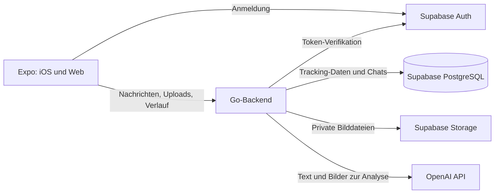

# Architektur

Stand: 17. September 2026. Architektur für den im [Umsetzungsplan](PLAN.md) beschriebenen ersten nutzbaren Stand; Coolify-Betrieb und native Geräteabnahme stehen noch aus.

## Aufbau und Zuständigkeiten



Go, Supabase und die Weboberfläche werden über Coolify auf eigener Infrastruktur betrieben. OpenAI ist der externe Dienst für KI-Verarbeitung. Selbst gehostete Speicherung bedeutet daher nicht, dass die Bildanalyse ausschließlich auf dem eigenen Server stattfindet.

| Komponente | Verantwortung |
| --- | --- |
| Expo-App | Login, Tagesnavigation, Chat, Bildauswahl, Tageswerte und Korrekturen anzeigen |
| Go-Backend | Benutzerzugriff prüfen, Uploads verarbeiten, Kontext aufbauen, OpenAI aufrufen, Ergebnisse validieren und Tracking schreiben |
| Supabase Auth | Identität, Anmeldung und Sitzungen verwalten |
| PostgreSQL | Dauerhafte fachliche Daten und Verarbeitungszustände speichern |
| Supabase Storage | Fotos und Screenshots unter privaten Objektpfaden speichern |
| Coolify | Dienste bereitstellen, Secrets und persistente Volumes konfigurieren |

Die erste Version verwendet einen Go-Service. Zusätzliche Microservices, eine separate Queue-Plattform oder eine Vektordatenbank sind für den vereinbarten Umfang nicht vorgesehen.

## Projektstruktur

```text
fitty/
  README.md
  docs/
    PLAN.md
    ARCHITEKTUR.md
  apps/
    client/             # Expo-Projekt für iOS und Web
  server/               # Go-Modul mit API und Verarbeitung
  supabase/
    migrations/         # Versionierte SQL-Migrationen
  deploy/               # Anwendungsspezifische Coolify-/Container-Konfiguration
```

Anmeldung, Profil, Tageschat, Text-Tracking, Korrekturen und private Fotoanhänge mit Bildanalyse sind implementiert. Der lokale Supabase-Stack wird über die versionierte CLI-Konfiguration betrieben; Secrets und eine Kopie des gesamten Upstream-Projekts gehören nicht ins Repository. Die [Entwicklungsanleitung](ENTWICKLUNG.md) beschreibt Tests und verbleibende Prüfgrenzen.

## Anmeldung und Datenzugriff

Die App meldet sich bei Supabase Auth an und übermittelt ihr Access Token an Go. Go lässt das Token bei jeder Anfrage durch den konfigurierten Supabase-Auth-Dienst über `GET /auth/v1/user` prüfen (maximal fünf Sekunden). Die Benutzeridentität stammt ausschließlich aus dessen erfolgreicher Antwort. Eine lokale JWT-Verifikation mit JWKS ist derzeit nicht implementiert. Eine vom Client angegebene Benutzer-ID reicht nicht als Berechtigung.

Go greift intern per PostgreSQL-Verbindung auf die fachlichen Daten zu. Jede Lese- und Schreiboperation ist auf den angemeldeten Benutzer begrenzt; auch referenzierte Chats, Einträge und Bilder müssen diesem Benutzer gehören. Das Datenbankkonto `fitty_api` besitzt nur die benötigten Rechte auf den Anwendungstabellen, einschließlich DELETE für die Bereinigung von Anhängen. Es ist weder Superuser noch Mitglied privilegierter Rollen.

Die automatisch angebotene Supabase Data API wird für fachliche Tabellen nicht benötigt. Diese Tabellen werden nicht für den Client freigegeben. Falls eine direkte Freigabe später hinzukommt, werden passende Grants und RLS-Regeln ausdrücklich eingerichtet. Die Go-Verbindung erhält nicht automatisch den Auth-Kontext einer Supabase-Clientanfrage.

Bilder liegen in privaten Buckets. Go vermittelt Upload und Abruf beziehungsweise stellt nach Berechtigungsprüfung kurz gültige Download-Links aus. Dauerhaft gespeichert werden Objektpfade, keine ablaufenden signierten URLs. Service-Schlüssel und OpenAI-Schlüssel bleiben ausschließlich auf dem Server.

## Fachliches Datenmodell

Die folgenden Tabellen sind als Migrationen umgesetzt. Essen und Bewegung verwenden dieselbe Eintragstabelle mit einem Typfeld und typabhängigen Datenbank-Constraints.

| Tabelle | Wesentliche Inhalte |
| --- | --- |
| `profiles` | Bezug zum Auth-Benutzer, Zeitzone, Freitextziele, Ernährungsvorlieben und Version der numerischen Ziele |
| `daily_targets` | Freiwillige Kalorien-/Makroziele je Benutzer und Gültigkeitsdatum |
| `daily_target_changes` | Beleg eines Ziel-Speichervorgangs mit Request-ID, erwarteter Version, Datum und Zielwerten |
| `days` | Benutzer, lokales Datum, Tageschat und Version für Löschbestätigungen |
| `messages` | Tag, Rolle, Text, clientseitige Nachrichten-ID und Verarbeitungsstatus |
| `attachments` | Benutzer, Datum, optionale Nachricht, Position, Storage-Pfad, SHA-256, Medientyp, Größe, Abmessungen und Uploadstatus |
| `tracking_entries` | Typ Essen/Aktivität, Tag, Bezeichnung, Mengenangabe, Energie, Makronährstoffe beziehungsweise Dauer/Strecke, Datenherkunft und Quellnachricht |
| `analysis_jobs` | Nachricht, Verarbeitungsstatus, Versuche, Lease und Modell |
| `entry_changes` | Änderung samt vorherigem/nachherigem Wert, Quellnachricht und Belegtext |
| `manual_entry_changes` | Direkte Änderung samt Benutzer, Request-ID, erwarteter Version und vorherigem/nachherigem Wert |
| `day_deletions` | Löschbestätigung mit Benutzer, Request-ID, Tages-ID, Datum und erwarteter Version; ohne Chatinhalt |
| `deleted_identifiers` | Stillgelegte Nachrichten-/Bild-UUIDs zum Abweisen verspäteter Wiederholungen |
| `progress_photos` | Private Fortschrittsfotos mit Aufnahmedatum, Perspektive, Objektpfad und Upload-/Löschstatus |
| `progress_photo_tombstones` | Gelöschte Fortschrittsfoto-UUIDs pro Benutzer, ohne Bilddaten |

Wichtige Regeln:

- Pro Benutzer und lokalem Datum existiert höchstens ein Tageschat.
- Technische Zeitstempel werden in UTC gespeichert; der fachliche Tag wird über die Profilzeitzone beziehungsweise den ausdrücklich gewählten Zieltag bestimmt.
- Eine neue Profilzeitzone verschiebt bereits gebuchte Einträge nicht stillschweigend auf andere Tage.
- Ein Upload und eine Nachricht können mehrere zusammengehörige Bilder enthalten. Die Zahl der Bilder bestimmt nicht die Zahl der Mahlzeiten.
- Nährwerte sind auf die verzehrte Menge bezogen. Herkunft und Annahmen unterscheiden Nutzereingaben, abgelesene Angaben und KI-Schätzungen.
- Kalorien und Nährwerte werden mit geeigneten Dezimalwerten gespeichert; Darstellungsrundung erfolgt erst bei der Ausgabe.
- Essens- und Aktivitätseinträge verweisen auf ihre ursprüngliche Nachricht und bei Korrekturen auf die korrigierende Nachricht.
- Tageswerte entstehen aus den gültigen strukturierten Einträgen. Sie werden nicht aus wechselnden KI-Zusammenfassungen übernommen.
- Ergebnisse und Bilder bleiben auch verfügbar, wenn die OpenAI API vorübergehend nicht erreichbar ist.

Direkte Änderungen verwenden dieselben fachlichen Wertebereiche wie die KI. Eintragsversionen verhindern das Überschreiben neuerer Werte; Request-IDs machen Wiederholungen idempotent. Die Mutation und das manuelle Protokoll werden gemeinsam gespeichert. Während ausstehender KI-Auswertungen wartet die direkte Bearbeitung; die Übernahme neuer Worker-Aufträge und direkte Änderungen koordinieren sich über einen kurzen gemeinsamen Advisory Lock. Es wird dabei kein Modell aufgerufen. Eine Eintragslöschung setzt `deleted_at`, sodass sie sofort aus aktiven Summen entfällt. Historische Chats, Fotos und Änderungsprotokolle bleiben bestehen; das ist von der vollständigen Chatlöschung zu unterscheiden.

## Persönliche Tagesziele

Numerische Ziele werden getrennt vom bestehenden Freitextprofil gespeichert. Jeder Stand gilt ab `effective_from` bis zum nächsten Stand. Für einen Tageschat lädt Go den jüngsten Stand mit Gültigkeitsdatum kleiner oder gleich dem Chatdatum. Vor dem ersten Stand sind alle Ziele `null`; ein späterer Stand mit ausschließlich `null` hebt Ziele ab diesem Datum auf. Mehrere Änderungen am selben Tag ersetzen dessen Zielstand. Eine Chatlöschung entfernt weder Ziele noch deren Verlauf.

Neue Zieländerungen dürfen ausschließlich ab heute in der gespeicherten Profilzeitzone gelten. PostgreSQL speichert positive Dezimalwerte mit zwei Nachkommastellen; jedes der vier Felder kann unabhängig `null` sein. Es gibt keine automatische Ableitung aus Körperdaten, Makros oder Aktivitätsverbrauch. API-Speicherung, Tagesübersicht und KI-Kontext verwenden dasselbe Werteobjekt.

Die Profilzeile serialisiert Zieländerungen und Zeitzonenänderungen. Zielstand, erhöhte `targets_version` und Request-Beleg werden in einer Transaktion gespeichert. Veraltete Versionen oder ein inzwischen anderes heutiges Datum verlangen eine erneute bewusste Bestätigung. Eine identische, bereits bestätigte Request-ID verändert nichts mehr und liefert den aktuellen Zielstand, auch nach Tageswechsel oder weiteren Änderungen. Profiländerungen über den bisherigen Endpunkt lassen numerische Ziele unberührt.

Tageswerte bleiben aus gespeicherten Einträgen berechnet. Zielbalken vergleichen diese Aufnahme mit dem gültigen Ziel; Aktivitätsverbrauch bleibt separat. Go gibt Ziele als `daily_targets` an die KI weiter. Die Anweisung erlaubt sie als Beratungskontext, jedoch nicht als Verzehrbeleg oder Anlass für automatische Zieländerungen. Die Qualität dieser Beratung ist zusätzlich mit Alltagsbeispielen zu beurteilen.

## Lokale Entwürfe und Wiederaufnahme

Gespeicherte Nachrichten bleiben serverseitig maßgeblich. Ungesendete Tagesentwürfe liegen pro Benutzer und Datum ausschließlich auf dem jeweiligen Gerät: Web nutzt IndexedDB für Metadaten und JPEG-Blobs in einer Transaktion, iOS AsyncStorage plus Dateien im Dokumentverzeichnis. Relative native Pfade überstehen einen geänderten App-Verzeichnispfad. Revisionen verhindern das Überschreiben neuerer Entwürfe durch andere Tabs; leere Versionszeilen verhindern das Wiederherstellen durch verspätete Schreibvorgänge.

Ein Sendeauftrag wird mit stabiler Nachrichten-ID vor dem ersten Upload gespeichert. Eine bereits bestätigte Löschanfrage wird vor dem Serverrequest ebenso gespeichert. Wiederaufnahme erfordert jeweils einen bewussten Versuch mit derselben ID; es gibt keinen automatischen Hintergrundversand. Bestätigte Vorgänge leeren den lokalen Entwurf erst nach erfolgreicher Speicherung des Abschlusses. Lokale Entwürfe bleiben beim Abmelden erhalten, werden ausschließlich für das zugehörige Konto geladen und können ausdrücklich verworfen werden. Speicherfehler sind sichtbar; Nutzer müssen einen offenen Speichervorgang abschließen, bevor ein neuer Versand beginnt.

Es gibt keine geräteübergreifende Entwurfssynchronisation und noch keinen vollständigen Offline-Start. Lokale Entwürfe sind keine Serverbackups und werden durch Entfernen der App-/Browserdaten verloren. Native Dateisystem-/Metadatenfehler sowie atomare Browser-Schreibvorgänge sind mit kontrollierten Adaptern beziehungsweise Chromium geprüft; ein echter iPhone-Lauf steht aus.

## Löschen eines Tageschats

Die Löschvorschau liefert die konkrete Tages-ID, Version und Anzahl der Nachrichten, aktiven Einträge und Fotos. Eine Bestätigung ist nur für diesen Stand gültig. Neue Nachrichten, KI-Ergebnisse, direkte Änderungen und zusätzliche Fotoreservierungen erhöhen die Tagesversion. Ein später neu angelegter Chat desselben Datums erhält eine neue ID.

In einer Transaktion legt Go einen Löschbeleg an, sperrt die bisherigen Nachrichten-/Bild-UUIDs gegen erneute Verwendung, markiert alle zugehörigen Fotos einschließlich ungebundener Uploads zur Bereinigung und löscht den Tag. Fremdschlüssel entfernen Nachrichten, Analyseaufträge, sämtliche Einträge sowie beide Änderungsverläufe. Wiederholungen prüfen zuerst den Löschbeleg: Eine alte bestätigte Anfrage kann keinen neu angelegten Chat löschen. Laufende externe KI-Aufrufe können bereits übertragen sein; ihre Ergebnisse werden nach Löschung nicht mehr gespeichert.

Der Foto-Worker entfernt zuerst das private Objekt und anschließend die vorgemerkte Datenbankzeile. Bei Storage-Ausfall bleibt der Auftrag über einen Serverneustart erhalten. Neue signierte URLs und erneute Uploads mit alten IDs werden abgewiesen. Neue Bilder mit neuer UUID nach der Löschung gehören nicht zum alten Auftrag. Nachrichtenlisten und Tageswerte liefern die Tages-ID, damit der Client bei Löschung oder Neuanlage auch zuvor geladene ältere Nachrichten verwirft.

Löschbelege und stillgelegte UUIDs enthalten keinen Chattext, keine Nährwerte und keine Bilddaten; sie bleiben bis zur Kontolöschung erhalten. Die Löschung betrifft den aktiven Bestand. Bereits heruntergeladene Kopien und vorhandene Backups werden dadurch nicht entfernt. Automatische Backups und deren Aufbewahrungszeit sind noch nicht eingerichtet; sie werden vor dem Coolify-Produktivbetrieb festgelegt. Nach einem Restore müssen seit der Sicherung bestätigte Löschungen erneut angewendet werden, bevor der Datenbestand wieder freigegeben wird.

## Fortschrittsfotos

Fortschrittsfotos verwenden eine eigene Tabelle und die Objektpfade `<user>/progress/<id>.jpg` im bestehenden privaten Bucket `chat-attachments`. Sie verweisen weder auf Nachrichten noch auf Tageschats. Der KI-Kontext liest weiterhin ausschließlich deren separate Chat-Anhangstabelle; Fortschrittsfotos sind auch nicht als Nachrichtenanhänge referenzierbar. Eine Tageschat-Löschung verändert sie nicht.

Der Client bereitet die gewählte Aufnahme mit derselben JPEG-Aufbereitung wie Chatfotos auf. Vor dem ersten Storage-Aufruf reserviert Go die UUID zusammen mit Aufnahmedatum, Perspektive und Hash des normalisierten Bildes dauerhaft. Erst nach erfolgreichem Storage-Schreiben wird die Aufnahme sichtbar. Identische Wiederholungen bestätigen denselben Datensatz. Abweichende Angaben zur selben ID werden abgewiesen. Gespeicherte Aufnahmen sind unveränderlich; bei falschem Datum oder falscher Perspektive wird die Aufnahme entfernt und neu hinzugefügt.

Der Verlauf liefert 24 Aufnahmen pro Seite, sortiert nach Datum und UUID. Ein Cursor aus beiden Feldern verhindert, dass mehrere Fotos desselben Tages übersprungen werden. Signierte Vorschauen gelten zehn Minuten und werden nur für eigene, fertige und nicht entfernte Aufnahmen ausgestellt. Der Client lädt sie bei Bedarf neu und zeigt Bilder vollständig mit Datum und Perspektive an.

Entfernen markiert die Aufnahme und speichert ihre stillgelegte ID in einer Transaktion. Sie verschwindet sofort aus dem aktiven Verlauf. Der bestehende Bereinigungsworker löscht das private Objekt anschließend, bei einem Storage-Ausfall mit späterem erneutem Versuch. Nicht abgeschlossene Uploads werden nach 24 Stunden bereinigt; fertige Fotos altern nicht automatisch aus. Bei Kontolöschung verbleiben die Objektmetadaten ohne Benutzer bis zur Bereinigung. Reservierung, Entfernen und Bereinigung koordinieren sich über dieselbe Bild-ID, damit verspätete Uploads gelöschte Inhalte nicht wiederherstellen.

Die Fotoauswahl vor dem Upload und die A/B-Vergleichsauswahl sind nur im Arbeitsspeicher. Es gibt keine automatische Wiederaufnahme eines Uploads nach App-Neustart. In der geöffneten Ansicht bleiben unbestätigte Uploads mit denselben Bytes und Angaben wiederholbar; die Navigation bleibt bis zur Bestätigung gesperrt. Ein noch nicht abgeschicktes Foto kann bewusst verworfen werden.

## Verarbeitung einer Nachricht

1. Go prüft Anmeldung, Tageszuordnung und die vom Client vergebene Nachrichten-ID.
2. Nachricht und Anhänge werden gespeichert. Dieselbe Nachrichten-ID darf beim erneuten Senden keinen zweiten Auftrag erzeugen.
3. Das Backend stellt Profil, die für das Chatdatum gültigen Ziele, Tageswerte, relevante Einträge und den notwendigen Gesprächsverlauf zusammen.
4. Ein OpenAI-Modell analysiert Text und gegebenenfalls Bilder. Es liefert eine Antwort und strukturierte Vorschläge für Erfassung oder Änderung.
5. Go prüft Format, Einheiten, Wertebereiche, Zieltag und referenzierte Einträge. Mehrdeutige Änderungen führen zu einer Rückfrage.
6. Zulässige Änderungen, Änderungsprotokoll, Analyseantwort und erfolgreicher Verarbeitungsstatus werden gemeinsam in einer Datenbanktransaktion gespeichert.
7. Die Oberfläche lädt die aktualisierten Nachrichten, Einträge und Tageswerte.

Der externe API-Aufruf findet außerhalb einer offenen Datenbanktransaktion statt. Verarbeitungsstatus und Auftragszuordnung werden dauerhaft gespeichert. Ein Worker pro Go-Prozess übernimmt persistente Jobs. PostgreSQL koordiniert die Übernahme; Nachrichten eines Tages werden nacheinander bearbeitet. Eine zweiminütige Lease mit wechselnder ID verhindert, dass verspätete Ergebnisse nach erneuter Übernahme verbucht werden. Abgelaufene Verarbeitung wird nach Neustart wieder aufgenommen, maximal drei Versuche pro Nachricht. Eine zusätzliche Queue-Infrastruktur ist nicht nötig.

Bei einem Retry darf ein bereits übernommenes Ergebnis nicht erneut verbucht werden. Ein erneuter externer API-Aufruf nach einem Abbruch kann trotzdem Kosten verursachen; deshalb werden Ergebnisse und Status frühzeitig gesichert und Wiederholungen begrenzt.

Ein kleines strukturiertes Antwortschema unterscheidet fachlich:

- Neue tatsächlich konsumierte Mahlzeiten oder abgeschlossene Aktivitäten.
- Korrekturen beziehungsweise Löschungen eindeutig identifizierter Einträge.
- Beratung und geplante Handlungen ohne Buchung.
- Rückfragen bei fehlenden oder widersprüchlichen Angaben.

Eine Nachricht kann mehrere dieser Bestandteile enthalten. Die KI erhält keine Möglichkeit, frei SQL auszuführen. Strukturierte Ausgaben erleichtern die Verarbeitung, garantieren aber keine fachlich korrekten Nährwerte.

## Bildverarbeitung

Die Expo-App bereitet maximal vier Bilder als JPEG mit höchstens 2.048 Pixeln je Seite auf. Auf iOS wird die kompatible Bildrepräsentation angefordert; die native Konvertierung und Kamera bleiben auf einem echten Gerät zu prüfen. Go akzeptiert JPEG, PNG und WebP bis 8 MiB, 4.096 Pixel je Seite und 12 Megapixeln. Formatprüfung, vollständiges Decodieren und erneutes JPEG-Encoding entfernen unter anderem EXIF-/Standortdaten. Gespeichert wird die aufbereitete Bilddatei; die Oberfläche zeigt daraus kleine und vergrößerte Vorschauen.

Vor dem Storage-Aufruf reserviert Go einen persistenten Upload mit clientseitiger UUID und Prüfsumme. Gleiche ID und gleiche Bilddaten lassen sich nach einem Abbruch wiederholen; abweichende Daten werden abgewiesen. `pending` wird nach erfolgreichem Upload zu `ready`. Beim Senden verknüpft eine Transaktion ausschließlich eigene, fertige Bilder desselben Tages mit der Nachricht. Die Reihenfolge der Bild-IDs gehört zum idempotenten Nachrichteninhalt.

Ungebundene Uploads werden nach 24 Stunden gelöscht. Nach Löschung eines Kontos bleibt die Objektzuordnung ohne Benutzer für die Bereinigung erhalten. Ein Worker prüft beim API-Start und stündlich höchstens 50 fällige Dateien, entfernt zuerst das Storage-Objekt und anschließend dessen Datenbankzeile. Fehler erhalten den Auftrag für den nächsten Lauf; Zeilensperren koordinieren Upload, Zuordnung und Bereinigung. Der Client kann noch nicht versendete Anhänge ausdrücklich entfernen. Die vollständige Chatlöschung markiert Bilder sofort für die Bereinigung; diese Aufträge werden alle fünf Sekunden in begrenzten Batches erneut versucht.

Go übermittelt Bilddaten als Base64-`input_image` mit `detail: high` an die Responses API; der Bucket bleibt privat. Mitgesendet werden höchstens vier Bilder der aktuellen Nachricht. Bei einer Textnachricht ohne neue Bilder wird stattdessen die jüngste Bildnachricht aus dem bereits begrenzten Tagesverlauf verwendet, damit Rückfragen und Mengenänderungen möglich bleiben. Das gilt derzeit auch für andere Textfragen dieses Tages und kann zusätzliche Bildtokens kosten. Ältere Bildgruppen und andere Tage werden nicht automatisch nachgeladen.

Ein Schreibvorschlag braucht einen wörtlichen Ausschnitt der aktuellen Nachricht oder `image:<ID>` eines aktuellen Anhangs (`Bild:<ID>` wird ebenfalls verstanden). Beide Bildpräfixe werden ausschließlich gegen tatsächlich mitgelieferte aktuelle Anhänge geprüft. Historische Bilder sind Kontext, kein unmittelbarer Buchungsbeleg. Das Schema verlangt vollständige Werte beim Anlegen und Ändern; nur beim Löschen ist der Eintrag `null`. Das Modell erhält keine Storage-Schlüssel und keine frei wählbaren Bild-URLs.

Für die Anzeige stellt Go nach Besitzerprüfung zehn Minuten gültige Links aus. Der Client erneuert sie nach neun Minuten. Wer einen solchen Link besitzt, kann ihn bis zum Ablauf verwenden; er wird deshalb weder protokolliert noch dauerhaft gespeichert.

### Auswertung nach Bildtyp

| Bildtyp | Verarbeitung | Umgang mit Unsicherheit |
| --- | --- | --- |
| Mahlzeit | Sichtbare Lebensmittel und plausible Portionen zuordnen | Öl, verborgene Zutaten und Mengen nicht als sicher bekannt darstellen |
| Verpackung/Etikett | Produkt- und Nährwertangaben lesen; Menge umrechnen | Werte pro 100 g, pro Portion und Packungsgröße unterscheiden; schlecht lesbare Angaben erfragen |
| Trainings-/Walking-Pad-Screenshot | Sichtbare Dauer, Strecke, Tempo und Geräteangaben extrahieren | Abgelesenen Energieverbrauch als Geräteangabe kennzeichnen |
| Speisekarte | Gerichte erkennen und im Tageskontext besprechen | Keine konsumierte Mahlzeit ohne entsprechende Aussage anlegen |

Beim Prüfen werden verfügbare Hinweise abgeglichen: Bildinhalt, lesbare Verpackungsangaben, Nutzermenge und bisheriger Chat. Eine unabhängige Nährwertdatenbank ist zunächst nicht Bestandteil des Plans. Das Ergebnis bleibt daher eine unterstützte Erfassung mit nachvollziehbaren Schätzungen, keine Messung des tatsächlichen Energiegehalts.

## Gesprächskontext und Gedächtnis

Ein neuer Tageschat beginnt mit dauerhaftem Profilwissen und dem jeweiligen Tagesstand. Für frühere Tage lädt Go bei Bedarf passende Einträge oder Zusammenfassungen aus PostgreSQL. Die Datenbank ist die maßgebliche Quelle; providerseitige Gesprächsspeicherung ist keine Voraussetzung für den Verlauf.

Der gesamte alte Verlauf und alle Bilder werden nicht bei jeder Nachricht erneut übertragen. Zunächst reicht begrenzter Kontext aus Profil, aktuellem Chat und gezielt geladenen vergangenen Tagen. Zusammenfassungen dürfen strukturierte Einträge nicht überschreiben.

Für Essensberatung werden bisherige Aufnahme, ausdrücklich hinterlegte Ziele und Vorlieben berücksichtigt. Die Anwendung erfindet keine persönlichen Ziele. Tageswechsel darf nicht dazu führen, dass Profilwissen verloren geht.

## Oberfläche und Synchronisation

Die Oberfläche besteht zunächst aus „Heute“, „Verlauf“ und „Profil“. Auf dem Desktop kann die Tagesliste neben dem Chat stehen; auf dem iPhone wird sie separat geöffnet. Beide Varianten nutzen dieselbe API.

Go liefert den gespeicherten Zustand. Einfache Statusabfragen reichen zunächst für laufende Analysen und das Aktualisieren nach Rückkehr in die App. Antwortstreaming kann das Chatgefühl später verbessern, ersetzt aber nicht die dauerhafte Speicherung der fertigen Antwort.

Nach einem Netzwerkfehler bleibt die clientseitige Nachrichten-ID beim erneuten Senden erhalten. Noch nicht erfolgreich gespeicherte Inhalte werden sichtbar von abgeschlossenen Einträgen unterschieden. Ein Bildschirmwechsel oder unterbrochener Stream darf keine zweite Mahlzeit auslösen.

## Betrieb und Wiederherstellung

- Supabase, Go und Weboberfläche werden über Coolify bereitgestellt; genaue Versionen werden bei Umsetzung geprüft und festgehalten.
- HTTPS schützt die öffentlich erreichbaren Endpunkte. PostgreSQL wird intern zwischen den Diensten angesprochen.
- SQL-Migrationen sind versioniert und werden kontrolliert vor der passenden Anwendungsversion ausgeführt.
- Supabase-Dateispeicher erhält persistente Volumes oder ein bewusst ausgewähltes Objektspeicher-Backend.
- Backups sichern PostgreSQL, die tatsächlichen Storage-Dateien und die zur Wiederherstellung nötige Konfiguration beziehungsweise Secrets an einem geschützten Ort außerhalb des Repositorys.
- Eine Backup-Kopie liegt außerhalb des Anwendungsservers. Aufbewahrungszeitraum und Löschverhalten werden vor dem Produktivbetrieb dokumentiert.
- Ein Restore-Test stellt mindestens Login, Tageschat, Tracking-Einträge und ein abrufbares Foto wieder her.
- Logs enthalten Status, Laufzeiten und technische Fehler, aber standardmäßig keine Tokens, Bilddaten oder vollständigen privaten Chatinhalte.
- Der Analyse-Worker begrenzt parallele Auswertungen, Versuche und KI-Ausgaben. Uploads sind nach Anzahl, Dateigröße und Abmessungen begrenzt. Das Modell ist konfigurierbar; ein eigener monetärer Tagesdeckel und ein Gesamtspeicherlimit gehören noch nicht zu diesem Stand.

Supabase-Storage-Metadaten in PostgreSQL ersetzen kein Backup der Bilddateien. Coolify-Bereitstellung allein gilt nicht als Nachweis einer funktionierenden Wiederherstellung.

## Technische Quellen

Die Quellen wurden während der Planung herangezogen. Konkrete Versionen, Modellverfügbarkeit und Konfigurationen werden vor der Implementierung erneut geprüft.

- [Expo: Gemeinsame Navigation für iOS und Web](https://docs.expo.dev/router/introduction/)
- [Expo: Web-Unterstützung](https://docs.expo.dev/workflow/web/)
- [Supabase: PostgreSQL](https://supabase.com/docs/guides/database/overview)
- [Supabase: Auth](https://supabase.com/docs/guides/auth)
- [Supabase: Private Storage-Buckets](https://supabase.com/docs/guides/storage/buckets/fundamentals)
- [Supabase: Storage-Metadaten und Dateien](https://supabase.com/docs/guides/storage/schema/design)
- [Supabase: Self-Hosting](https://supabase.com/docs/guides/self-hosting)
- [Coolify: Supabase-Service](https://coolify.io/docs/services/supabase)
- [OpenAI: Bildverständnis](https://developers.openai.com/api/docs/guides/images-vision)
- [OpenAI: Strukturierte Ausgaben](https://developers.openai.com/api/docs/guides/structured-outputs)
- [OpenAI: Gesprächskontext](https://developers.openai.com/api/docs/guides/conversation-state)
- [OpenAI: Getrennte Abrechnung von ChatGPT und API](https://help.openai.com/en/articles/9039756)
